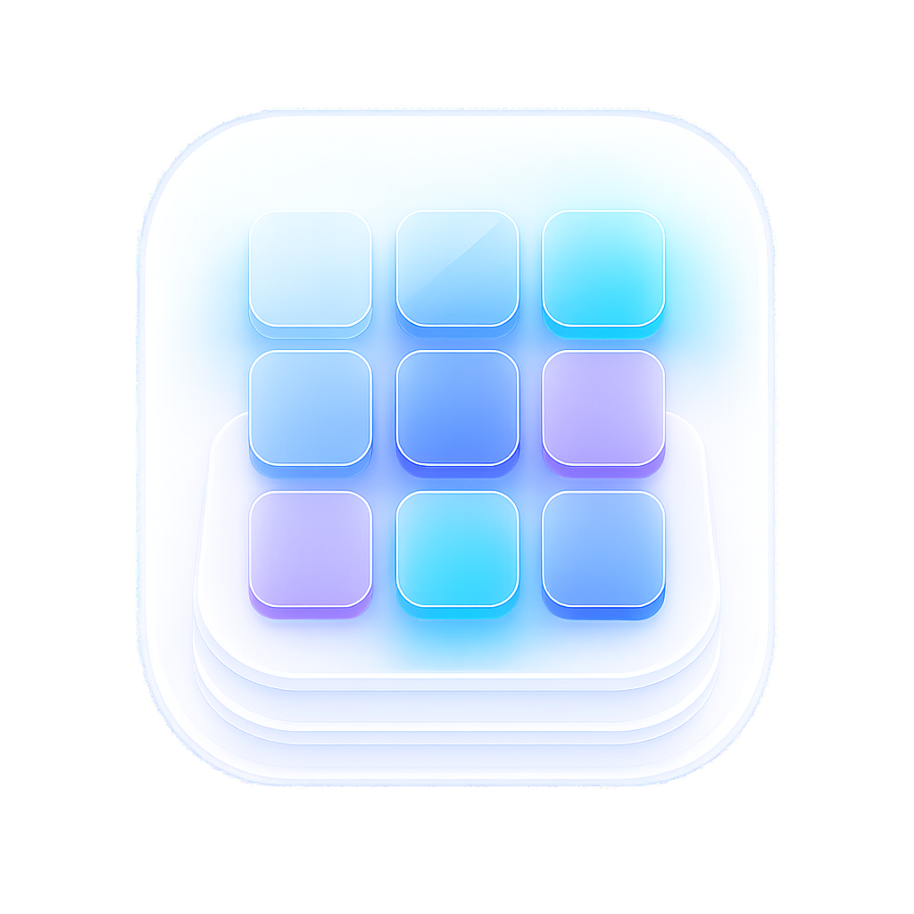

# LaunchpadX

<p align="center">
  
</p>

LaunchpadX 是一款使用 SwiftUI 与 AppKit 编写的原生 macOS 应用启动器，目标是在 macOS 26 中延续 macOS 15.6 经典“启动台”的核心操作体验。

当前版本：**1.0（Build 19）**

## 功能

### 启动与系统集成

- 原生全屏启动器面板，支持多显示器。
- 默认全局快捷键为 `⌥ Space`，可在设置中重新录制。
- 支持菜单栏入口和 Dock 图标。
- 支持登录时启动。
- 使用 Carbon 全局快捷键，不需要辅助功能权限。
- 防止重复运行；再次打开应用会激活已经运行的 LaunchpadX。
- 扫描并监听以下应用目录：
  - `/Applications`
  - `/System/Applications`
  - `/System/Cryptexes/App/System/Applications`
  - `~/Applications`

### 浏览与搜索

- 显示应用真实图标和系统本地化名称。
- 支持按应用名称、别名、Bundle ID、拼音全拼和拼音首字母搜索。
- 搜索结果会优先展示完全匹配、前缀匹配和名称包含匹配，使用频率只用于文本结果之间的轻量排序。
- 最多展示 9 个高相关结果，避免无关应用混入。
- 支持方向键、Enter 和自定义上一页/下一页快捷键。

### 妙控板与键盘

- 双指向左滑动：下一页。
- 双指向右滑动：上一页。
- 每次手势只翻一页，忽略惯性阶段造成的重复翻页。
- 可在设置中启用“翻页方向反转”。
- 五指捏合可尝试唤起 LaunchpadX。
- `Esc` 关闭文件夹、退出编辑或关闭启动器。

> 五指捏合依赖 macOS 是否把该手势事件传递给应用，可能受到系统手势设置影响。`⌥ Space` 是稳定可用的全局唤起方式。

### 编辑、排序与文件夹

- 长按应用图标 1 秒进入编辑模式，所有应用进入抖动状态。
- 长按触发后无需松开或移动光标，可直接继续拖拽。
- 拖拽应用可调整位置，其他图标实时向空位补齐。
- 页内移除应用后保留该页边界，不会自动从下一页抽取应用补位。
- 拖拽至左、右屏幕边缘可分别移动到上一页、下一页；首尾页不会越界。
- 将应用叠放到另一应用上可创建文件夹，并自动打开文件夹进行命名。
- 编辑模式下可打开已有文件夹、调整文件夹内应用顺序、拖入新应用或把应用移回外部。
- 文件夹少于两个应用时自动解散，剩余应用保留在文件夹原位置。
- 点击非应用图标的空白区域退出编辑模式。

### 设置

设置窗口只保留与启动台体验直接相关的项目：

- 常规：登录启动、打开时聚焦搜索、翻页方向反转。
- 快捷键：唤起 LaunchpadX、上一页和下一页。
- 布局：恢复应用排列、重新扫描应用。

## 技术栈

- macOS 26.0+
- Swift 6
- SwiftUI + AppKit
- SwiftData
- `NSWorkspace`、FSEvents、Carbon Hot Keys、ServiceManagement
- App Sandbox：关闭
- Hardened Runtime：开启

关闭 Sandbox 是为了扫描系统应用目录、监听应用安装与卸载并读取真实应用图标。该项目当前定位为本机自用和开源构建，不面向 Mac App Store。

## 项目结构

```text
LaunchpadX/
├── App/                    # 应用入口、依赖装配、菜单栏
├── Domain/                 # 启动器领域模型
├── Features/
│   ├── Launcher/          # 启动器界面、拖拽、手势、搜索
│   └── Settings/          # 设置界面与快捷键录制
├── Persistence/           # SwiftData Schema 与布局仓库
├── Services/              # 扫描、搜索、快捷键、登录项、监听服务
├── Shared/                # 设计令牌
└── Window/                # AppKit 面板与窗口控制器

Scripts/
├── generate-app-icons.swift
└── package-dmg.sh
```

## 本地开发

### 环境要求

- macOS 26.0 或更高版本
- Xcode 26 或更高版本

### 使用 Xcode

```bash
git clone https://github.com/prometheus-lumen/MAC-LAUNCHPADX.git
cd MAC-LAUNCHPADX
open LaunchpadX.xcodeproj
```

在 Xcode 中选择 `LaunchpadX` Scheme 后运行。

### 命令行构建

Debug 构建：

```bash
xcodebuild build \
  -project LaunchpadX.xcodeproj \
  -scheme LaunchpadX \
  -configuration Debug \
  -destination 'platform=macOS'
```

当前 Intel Mac 自用 Release 构建：

```bash
xcodebuild build \
  -project LaunchpadX.xcodeproj \
  -scheme LaunchpadX \
  -configuration Release \
  -destination 'platform=macOS,arch=x86_64' \
  ARCHS=x86_64 \
  ONLY_ACTIVE_ARCH=YES \
  CONFIGURATION_BUILD_DIR="$PWD/build/Release" \
  CODE_SIGN_IDENTITY=- \
  CODE_SIGNING_REQUIRED=YES
```

## 测试

运行全部单元测试和 UI 测试：

```bash
xcodebuild test \
  -project LaunchpadX.xcodeproj \
  -scheme LaunchpadX \
  -destination 'platform=macOS,arch=x86_64'
```

当前回归基线包含 26 项单元测试和 8 项核心 UI 测试，覆盖：

- 搜索精度、中文拼音与 Bundle ID 匹配。
- 双指翻页方向、方向反转和单次手势锁定。
- 页内排序、跨页移动及分页边界。
- 长按编辑、空白点击退出和位置持久化。
- 文件夹创建、重命名、拖入、内部排序、拖出和自动解散。

## 生成 DMG

先完成 Release 构建，再执行：

```bash
Scripts/package-dmg.sh
```

输出文件位于：

```text
build/LaunchpadX.dmg
```

脚本会对应用进行 ad-hoc 签名并保留 Hardened Runtime，同时在 DMG 中加入 `/Applications` 快捷方式。

当前流程不包含 Developer ID 签名、公证、自动更新或 Mac App Store 发布。首次运行自行构建的版本时，macOS 可能要求用户在 Finder 中右键选择“打开”。

## 应用图标

主图标源文件：

```text
LaunchpadX/AppIcon.icon/Assets/AppIcon-512@2x.png
```

重新生成传统 AppIcon 图片：

```bash
swift Scripts/generate-app-icons.swift \
  LaunchpadX/AppIcon.icon/Assets/AppIcon-512@2x.png \
  LaunchpadX/Assets.xcassets/AppIcon.appiconset
```

## 许可证

本项目使用 [GNU General Public License v3.0](LICENSE)。
